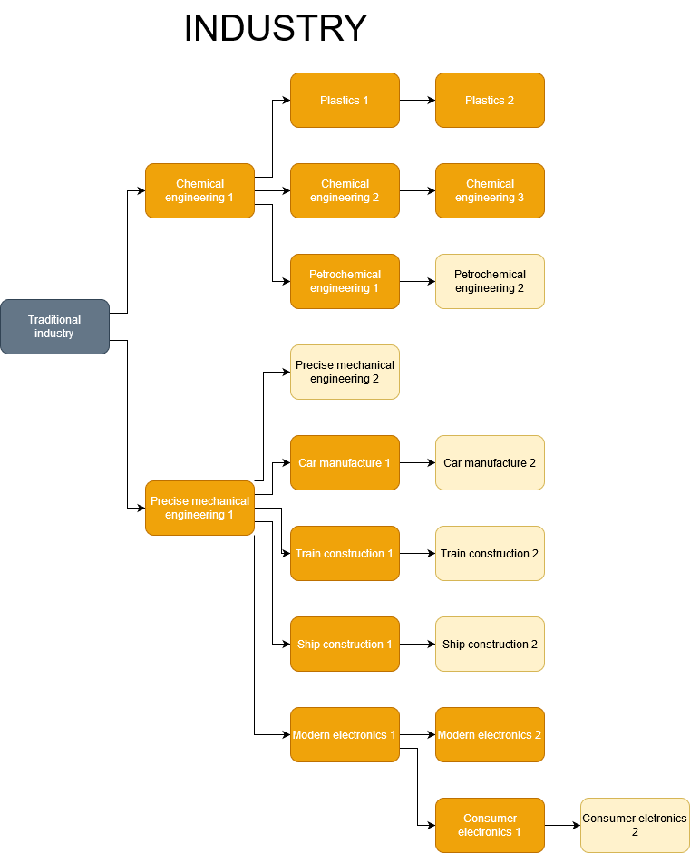
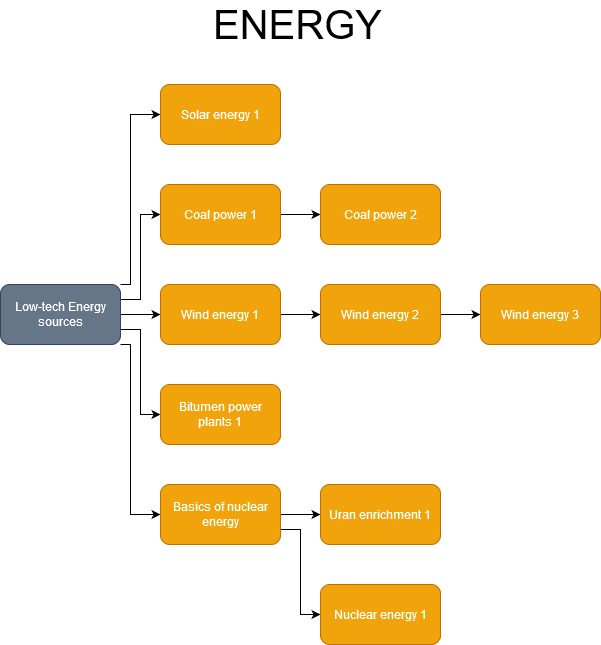
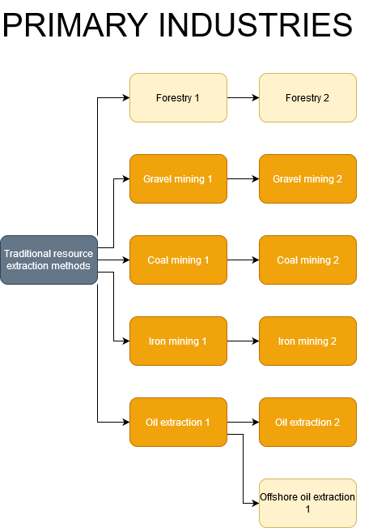

# Community tech tree for Workers & Resources

[](https://opensource.org/licenses/Apache-2.0)

The Community Tech Tree replaces the default vanilla tech tree with one
that is more expansive and comprehensive, and developed by the WRSR modding community.
The tree allows modders and content creators to lock their structures behind research
in a scalable and synchronized way.

The tree also adds more realistic and challenging gameplay, by expanding the contribution
of universities to your republic’s development. The tech tree adds new research to
all three university types (Technical, Medical, Political).






## Installation

Because the game does not support custom script modes or custom tech trees, some manual setup
is required. Because of this, a small batch script will run before your game launched.
The script will copy the tech tree to your game directory, and keep it up-to-date.
If you don’t want, or don’t need, automatic updates, follow the guide in the main github repository.

### Steam (auto-update) installation

1. Subscribe to [CTT workshop item][8] and let it download to your PC.
2. Go to the game page in your Steam library.
3. Go to game properties.
4. In **general** tab, click at the `SET LAUNCH OPTIONS`.
5. Add this line to your launch options:
```
"C:\Program Files (x86)\Steam\steamapps\workshop\content\784150\2072854744\ctt\ctt-update.bat" & %command%
```

### Manual installation

1. Download the repository:
   1. by cloning repository using GIT,
   2. or downloading a [ZIP file][3].
2. Merge `research` directory with the game's `research` directory.
   Path to this directory is
   `C:\Program Files (x86)\Steam\steamapps\common\SovietRepublic\media_soviet\research`.
3. ...
4. Enjoy and give us some feedback.

### Uninstallation

1. Remove ctt-update from your `SET LAUNCH OPTIONS`.
2. Verify integrity of your game, which should replace the CTT with vanilla tech tree.

## Features

* New tech tree with new technologies and more enjoyable and
  realistic progression.
* Tech tree that hides [modded assets][7] behind technologies.
* Added purpose to medical and political universities.
* Community driven way how to lock [buildings][7] behind the research.
* [Documentation][4] describing how to read and update a research tree.

## FAQ

* **Why don’t the new technologies have a name or description?**
   * Currently, there is no way to add custom names or descriptions to a research tree.
* **Will update reset my research?**
   * If you used other tech tree than CTT, the update will reset the researched
     and lock buildings again. Updates of CTT do not reset the research.
* **Which mods are supported by this mod?**
   * There is a [list][7] of supported mods.
* **How can I add my mod to the tech tree?**
   * Create an issue in the [official Github repository][2] to add your buildings.
     We will need the path in the following format `SteamID/building_name`,
     and the techs that should unlock your buildings.
   * Or, you can open up a pull request that adds your building(s) to the CTT.

## Contacts

For bug reports or feature requests, create an issue in the
[official Github repository][2].

If you want to get in touch with the maintainerss, ask some questions,
please visit our Discord server by link https://discord.gg/GXp46hs.

## Authors and acknowledgment

* CTT icon was created by Nyxyx.
* Basis of the ship icons have been created by [monkik][5].
* Radioactive icon has been created by [freepik][6].
* Wind energy icon has been created by [freepik][6].
* Oil rig icon has been created by [freepik][6].
* Solar power icon has been created by [freepik][6]. 

* CTT was brought to you thanks to:
   * cit1zen
   * ryantheskinny
   * Bertrios
   * argent
   * paradoxbound
   * Nyxyx

## License

[](https://opensource.org/licenses/Apache-2.0)

* If not stated otherwise, project resources are distributed under Apache 2.0 License.
* Technology icons ARE NOT distributed under this license.

[1]: resources/techtree.png
[2]: https://github.com/cit1zen/workers-and-resources-community-tech-tree
[3]: https://github.com/cit1zen/workers-and-resources-community-tech-tree/archive/master.zip
[4]: docs/research.md
[5]: https://www.flaticon.com/authors/monkik
[6]: https://www.flaticon.com/authors/freepik
[7]: docs/supported_mods.md
[8]: https://steamcommunity.com/sharedfiles/filedetails/?id=2072854744
